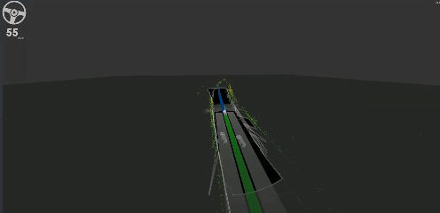
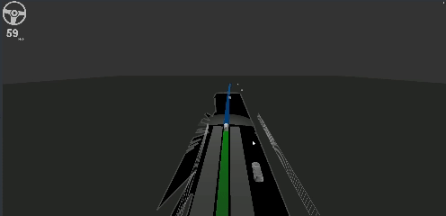

# ProtoVision-3D

## 安装库

pip.exe install pyassimp==4.1.3
pip install pyglm
pip install glfw PyOpenGL pyassimp numpy imgui opencv-python mediapipe
pip install pyrr
pip install pyqt5 imageio
pip install pywinstyles
pip install scikit-learn qt_material qtawesome pywin32

## 演示

<video width="800" height="600" controls muted loop>
  <source src="./SHOW/demo.mp4" type="video/mp4">
  您的浏览器不支持视频标签
</video>

## 接口文档
TBD   后续更新

## 使用方法
TBD   后续更新